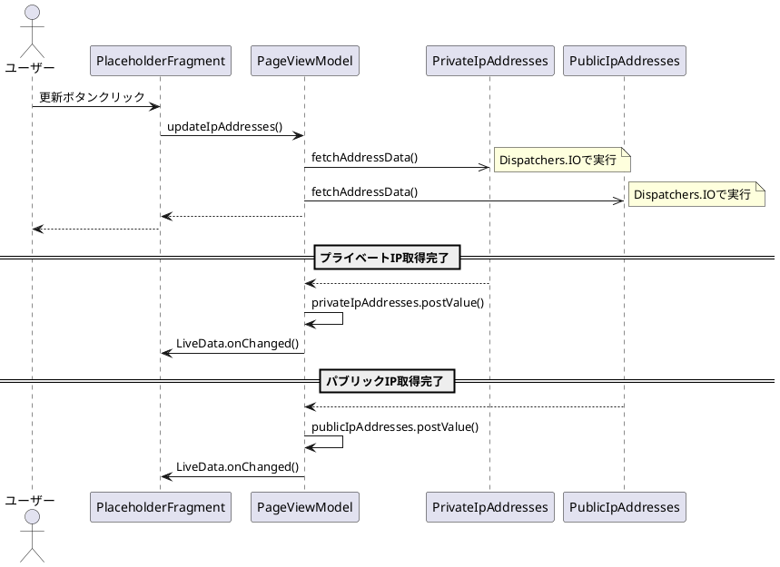

# シーケンス図
更新ボタンクリック時のシーケンス図を記載します。

```plantuml
@startuml
actor ユーザー as user
participant PlaceholderFragment as fragment
participant PageViewModel as viewmodel
participant PrivateIpAddresses
participant PublicIpAddresses

user -> fragment : 更新ボタンクリック

fragment -> viewmodel : updateIpAddresses()

viewmodel ->> PrivateIpAddresses : fetchAddressData()
note right : Dispatchers.IOで実行
viewmodel ->> PublicIpAddresses : fetchAddressData()
note right : Dispatchers.IOで実行
fragment <-- viewmodel
user <-- fragment

== プライベートIP取得完了 ==
viewmodel <-- PrivateIpAddresses
viewmodel -> viewmodel : privateIpAddresses.postValue()
viewmodel -> fragment : LiveData.onChanged()

== パブリックIP取得完了 ==
viewmodel <-- PublicIpAddresses
viewmodel -> viewmodel : publicIpAddresses.postValue()
viewmodel -> fragment : LiveData.onChanged()
@enduml
```